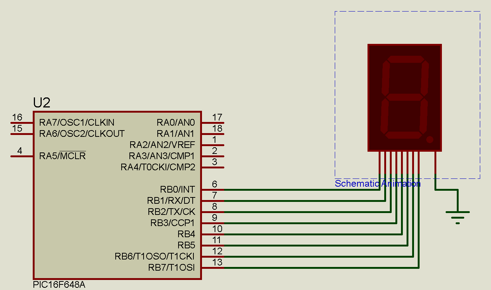

# LOGO

## Profesor: Gonzalo Vera

## Alumno: Fernando Gimenez Coria  

# **Presentación de la estructura de monorepositorio**

## TP#1: Simulación eléctrica

## TP#2: Simulación electrónica

## TP#3: CLC Circuitos Lógicos Combinacionales

## TP#4: Completar estructura ABP en GitHub y colocar perfil del estudiante

## TP#5: Síntesis de funciones logicas y circuitos secuenciales

## TP#6: Práctica con PIC16F84A  

## TP#10: Entrenador basico PIC16F648A

## Actualmente trabajando en 
## TP#10: Entrenador basico PIC16F648A

# **Resumen de repositorio actual TP#10**

**Objetivos**

1. Familiarizarse con un entorno de desarrollo de bajo nivel.

2. Introducir las primeras practicas con micros PIC de 8 bit.

3. Introducción a las primeras instrucciones en assembler.

4. Realizar desarrollos básicos con el PIC16F648.

 **Desarrollo del trabajo práctico**  

 1. Identificar la palabra de configuración y explicar que representa cada fusible. 

 2. Completar el código provisto en el entrenador básico PIC16f648, de manera que el display haga el conteo de 0 a 9. Se permite utilizar como delay la instrucción nop.

 Realizar los Ejercicios 1 y 2 utilizando esta guía y la plantilla vista en clases.

# Organización de la estructura del repositorio

Cada Trabajo Práctico se almacena segun la siguiente estructura:

1-requisitos: aquí se encuentran los requisitos propios del TP

2-investigación: aquí se guarda toda la documemtación recolectada para el desarrollo del TP

3-prototipos: Aquí se guardan  carpeta por carpeta los ejercicios propuestos en los requisitos. Además en el readme propio de la carpeta se encuentra la explicación de la palabra de configuración.

4-presentacion: Aquí se almacena un video con la explicacion del trabajo práctico.

# **Perfil del Alumno**

