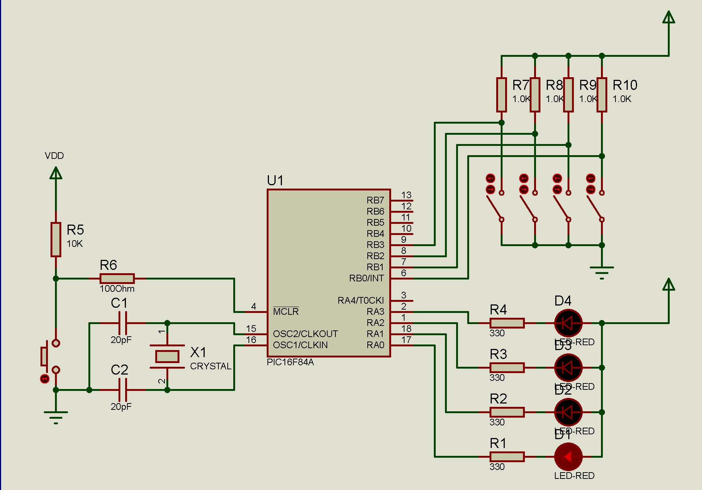

# LOGO

Profesor: Gonzalo Vera

Alumno: Fernando Gimenez Coria
# **Presentación de la estructura de monorepositorio**

## TP#1: Simulación eléctrica

## TP#2: Simulación electrónica

## TP#3: CLC Circuitos Lógicos Combinacionales

## TP#4: Completar estructura ABP en GitHub y colocar perfil del estudiante

## TP#5: Síntesis de funciones logicas y circuitos secuenciales

## TP#6: Práctica con PIC16F84A

## Actualmente trabajando en 
## TP#6: Práctica con PIC16F84A

# **Resumen de repositorio actual TP#6**

**Objetivos**

1. Familiarizarse con la programación en ensamblador en un microcontrolador.

2. Configurar y utilizar los registros especiales del PIC16F84A.

3. Implementar y probar un programa sencillo que controle LEDs con interruptores.

4. Comprender el funcionamiento básico de un microcontrolador.

 **Desarrollo del trabajo práctico**

 Realizar los Ejercicios 1 y 2 utilizando esta guía y la plantilla vista en clases.

**Guía de Ejercicio 1**

**Ejemplo de Aproximación a la Solución:**

Este primer ejercicio consiste en encender un LED específico basado en el estado
de un interruptor. En este caso, encenderemos el LED1 si el Interruptor1 está
presionado.
Instrucciones Claves:
1. **bsf** (Bit Set File Register): Establece un bit específico en un registro.
2. **bcf** (Bit Clear File Register): Limpia un bit específico en un registro.
3. **movlw** (Move Literal to W): Mueve un valor literal al registro W.
4. **movwf** (Move W to File Register): Mueve el contenido del registro W a un registro de archivo específico.
5. **btfsc** (Bit Test File Skip if Clear): Prueba un bit en un registro y salta la siguiente instrucción si el bit está claro.
6. **btfss** (Bit Test File Skip if Set): Prueba un bit en un registro y salta la siguiente instrucción si el bit está establecido.

Ejemplo 1:

Objetivo: Encender el LED1 cuando el Interruptor1 esté presionado.
Instrucciones:
1. Configura los pines de los puertos según sea necesario:
• TRISA para los LEDs (salidas).
• TRISB para los interruptores (entradas).
2. Lee el estado del interruptor correspondiente y controla el LED asociado.
3. Escribe el código en ensamblador usando las instrucciones claves.

Código Propuesto: (reemplazar en la plantilla, desde org 5 – hasta END)

            org 5 ; el programa empieza en la dirección de memoria 5

    inicio  bsf STATUS,5 ; se ubica en el segundo banco de RAM

            movlw 0f0h ; se carga el registro W con 0f

            movwf TRISA ; se programan los pines del puerto A como salidas

            movlw 0ffh ; se carga el registro W con ff

            movwf trisb ; se programan los pines del puerto B como entradas

            bcf STATUS,5 ; se ubica en el primer banco de memoria RAM

    ciclo   btfss ptob, 0 ; prueba si el bit 0 del puerto B está en 1

            bcf PTOA, 0 ; si no está presionado el interruptor 1, apaga el LED1

            btfsc ptob, 0 ; prueba si el bit 0 del puerto B está en 0

            bsf PTOA, 0 ; si está presionado el interruptor 1, enciende el LED1

            goto ciclo ; repite el ciclo

            END

Ejercicio 1:

• **Propuesta:** Utilizando el esquema de hardware y la plantilla proporcionada, implementa un programa en ensamblador que encienda el LED1 cuando el Interruptor1 esté presionado. Utiliza las instrucciones vistas y las indicaciones proporcionadas en esta guía.

**Guía de Ejercicio 2**

**Ejemplo de Aproximación a la Solución:**

En este ejercicio, vamos a encender los LEDs basados en combinaciones específicas de los interruptores. Por ejemplo, si los Interruptores 1 y 2 están presionados simultáneamente, encenderemos el LED1.

**Instrucciones Claves:**
1. **bsf** (Bit Set File Register): Establece un bit específico en un registro.
2. **bcf** (Bit Clear File Register): Limpia un bit específico en un registro.
3. **movlw** (Move Literal to W): Mueve un valor literal al registro W.
4. **movwf** (Move W to File Register): Mueve el contenido del registro W a un registro de archivo específico.
5. **btfsc** (Bit Test File Skip if Clear): Prueba un bit en un registro y salta la siguiente instrucción si el bit está claro.
6. **btfss** (Bit Test File Skip if Set): Prueba un bit en un registro y salta la siguiente instrucción si el bit está establecido.
7. **andlw** (AND Literal with W): Realiza una operación AND entre un literal y el registro W.

**Ejemplo 2:**

Objetivo: Encender los LEDs en función de combinaciones específicas de los
interruptores.

Instrucciones:
1. Configura los pines de los puertos según sea necesario:
• TRISA para los LEDs (salidas).
• TRISB para los interruptores (entradas).
2. Lee el estado de los interruptores y controla los LEDs basados en
combinaciones específicas.
3. Escribe el código en ensamblador usando las instrucciones claves.

Código Propuesto: (reemplazar en la plantilla, desde org 5 – hasta END)

            org 5 ; el programa empieza en la dirección de memoria 5

    inicio  bsf STATUS,5 ; se ubica en el segundo banco de RAM

            movlw 0f0h ; se carga el registro W con 0f

            movwf TRISA ; se programan los pines del puerto A como salidas

            movlw 0ffh ; se carga el registro W con ff

            movwf trisb ; se programan los pines del puerto B como entradas

            bcf STATUS,5 ; se ubica en el primer banco de memoria RAM

    ciclo   movf ptob, w ; lee el valor del puerto B y lo guarda en W

            andlw 03h ; realiza una AND entre el valor de W y 03h (00000011 en binario)

            xorlw 03h ; realiza una XOR entre el valor de W y 03h para verificar si los bits 0 y 1 están en 1
            btfsc STATUS, 2 ; verifica si el resultado de la XOR es cero (Z flag)

            bsf PTOA, 0 ; si ambos interruptores están presionados, enciende el LED1

            btfss STATUS, 2 ; si no, apaga el LED1

            bcf PTOA, 0

            movf ptob, w ; lee el valor del puerto B y lo guarda en W

            andlw 0Ch ; realiza una AND entre el valor de W y 0Ch (00001100 en binario)

            xorlw 0Ch ; realiza una XOR entre el valor de W y 0Ch para verificar si los bits 2 y 3 están en 1

            btfsc STATUS, 2 ; verifica si el resultado de la XOR es cero (Z flag)

            bsf PTOA, 1 ; si ambos interruptores están presionados, enciende el LED2

            btfss STATUS, 2 ; si no, apaga el LED2

            bcf PTOA, 1

            goto ciclo ; repite el ciclo

            END

**Ejercicio 2:**

• **Propuesta:** Utilizando el esquema de hardware y la plantilla proporcionada, implementa un programa en ensamblador que encienda los LEDs correspondientes (LED1, LED2) cuando los pares de interruptores (Interruptor1 y Interruptor2, Interruptor3 y Interruptor4) estén presionados simultáneamente. Utiliza las instrucciones vistas y las indicaciones proporcionadas en esta guía.

# Organizacion de la estructura del repositorio

Cada Trabajo Práctico se almacena segun la siguiente estructura:

1-requisitos: aqui se encuentran los requisitos propios del TP

2-investigación: aqui se guarda toda la documemtación recolectada para el desarrollo del TP

3-prototipos: Aqui se guardan  carpeta por carpeta los 3 ejercicios propuestos en los requisitos

4-presentacion: Aqui se almacena el resumen de circuitos secuenciales y flip-flops

# **Perfil del Alumno**

