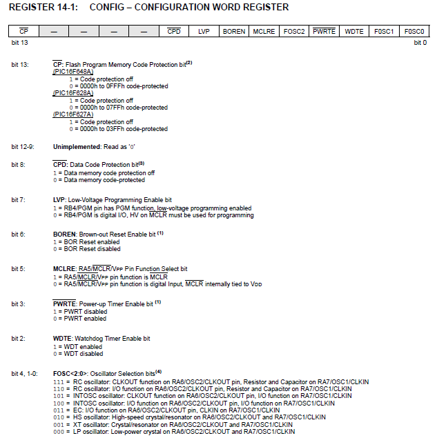

## PALABRA DE CONFIGURACION (Configuration Word)

- La palabra de configuración es un registro que contiene una serie de bits que sirven para determinar ciertos comportamientos y caracteristicas particulares del microcontrolador

- Según el extracto de la hoja de datos del PIC16F648A obtenemos la siguiente información:  

## 14.1 Configuration Bits
- The configuration bits can be programmed (read as ‘0’) or left unprogrammed (read as ‘1’) to select various device configurations. These bits are mapped in program memory location 2007h.
- The user will note that address 2007h is beyond the user program memory space. In fact, it belongs to the special configuration memory space (2000h-3FFFh), which can be accessed only during programming.  
- See “PIC16F627A/628A/648A EEPROM Memory Programming Specification” (DS41196) for additional information.

La traducción del apartado 14.1 es:
- Los bits de configuración se pueden programar (se lee como '0') o dejar sin programar (se lee como '1'), para seleccionar distintas configuraciones del dispositivo. Estos bits estan mapeados en la memoria de programa en la posición 2007h.  
- El usuario notará que la dirección 2007h esta fuera del espacio de memoria de programa disponible para el usuario. De hecho, este registro pertenece al espacio especial de memoria de configuración (2000h-3FFFh), el cual solo puede accederse durante la programación.  
- Ver “PIC16F627A/628A/648A EEPROM Memory Programming Specification” (DS41196) para obtener información adicional.
  
El significado de cada uno de los fusibles puede encontrarse en el capitulo 27 del manual PICmicro MID-RANGE MCU FAMILY Reference Manual (DS31030A).  
  
  

Ademas debido a que cada microcontrolador de la familia midrange tiene sus particularidades se debe observar en el archivo INCLUDE del compilar correspondiente a cada dispositivo, cuales son los fusibles disponibles para configurar.

Para nuestro caso del PIC16F648 en nuestro programa trabajamos los siguientes fusibles:  

>__CONFIG _CP_OFF & _CPD_OFF & _LVP_OFF & _BODEN_ON & _MCLRE_OFF & _PWRTE_ON & _WDTE_OFF & _INTOSC_OSC_NOCLKOUT

En este caso a la directiva __CONFIG fue cargada con los siguientes fusibles:  

- _CP_OFF: Code protection off.  
**La protección de codigo está apagada**

- _CPD_OFF: Data memory code protection off.  
**La protección de la memoria EEPROM de datos está apagada**

- _LVP_OFF: RB4/PGM pin has digital I/O function, HV on MCLR must be used for programming.  
**Modo de programación de bajo voltage desactivado. RB4 funciona como I/O y debe usarse los pines HV y MCLR para programar**

- _BODEN_ON: BOD enabled.  
**Brown-out reset habilitado (si el voltaje de alimentación cae por debajo de ciertos parametros el dispositivo se resetea).**

- _MCLRE_OFF: RA5/MCLR/VPP pin function is digital input, MCLR internally tied to VDD.  
**El pin RA5 funciona como entrada.**

- _PWRTE_ON: PWRT enabled.  
**El temporizador de encendido está habilitado.** 

- _WDTE_OFF: WDT disabled.  
**El temporizador watchdog está desabilitado.**  

- _INTOSC_OSC_NOCLKOUT: INTOSC oscillator: I/O function on RA6/OSC2/CLKOUT pin, I/O function on RA7/OSC1/CLKIN.  
**Se usará el reloj interno del microcontorlador y los pines RA6 y RA7 funcionan como entrada/salida.**    

